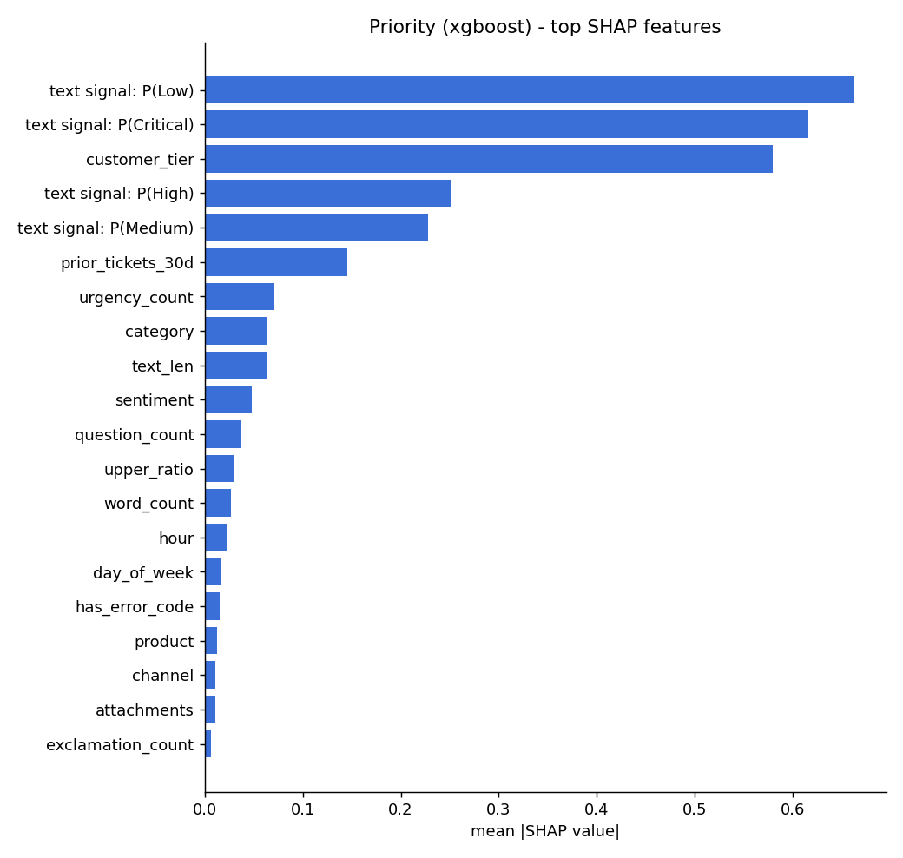
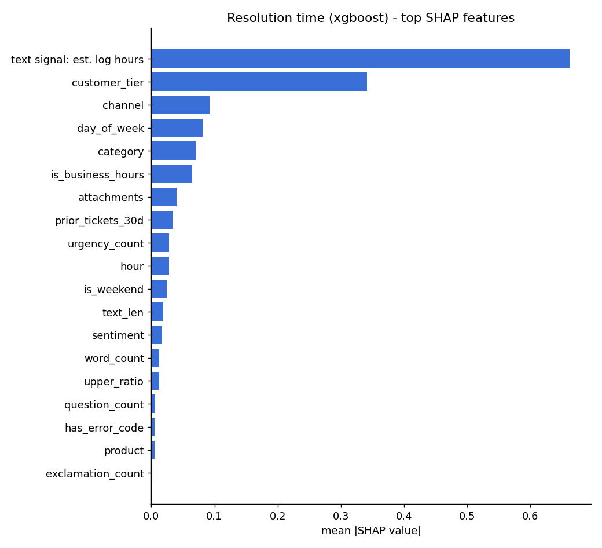

# Support Ticket Triage & Resolution-Time Predictor

An end-to-end ML system that reads an incoming support ticket (free text + metadata) and predicts:

1. **Priority** (Low / Medium / High / Critical), a 4-class classifier
2. **Time to resolution** in hours, a regressor
3. **Why**: per-ticket SHAP explanations an agent can act on, plus an SLA-breach flag

It covers NLP and structured feature engineering (NLTK, PySpark), model comparison (Logistic Regression,
Random Forest, XGBoost), explainability (SHAP), a Flask REST API, a Streamlit UI, Docker, and
infrastructure-as-code for deploying to AWS ECS Fargate.

**Stack:** Python · scikit-learn · XGBoost · SHAP · NLTK · PySpark · Flask · Streamlit · Docker · AWS CloudFormation (ECR, ECS Fargate, ALB)

---

## Results

Held-out test set (3,000 tickets, never seen during model selection):

| Task | Model | Metric | Baseline |
|---|---|---|---|
| Priority | **XGBoost** | **macro-F1 0.705**, accuracy 0.688 | majority class: macro-F1 0.130 |
| Resolution time | **XGBoost** | **MAE 12.2 h**, median AE 4.6 h, R² (log) 0.82 | median: MAE 24.4 h |

Model comparison (test set, each trained on the same split):

| Priority | macro-F1 | | Resolution time | MAE (h) |
|---|---|---|---|---|
| Logistic Regression | 0.684 | | Ridge | 12.94 |
| Random Forest | 0.697 | | Random Forest | 12.40 |
| **XGBoost** | **0.701** | | **XGBoost** | **12.19** |

- Almost all priority errors fall between **adjacent** levels (Medium↔High, Low↔Medium). Across 3,000
  test tickets, no Low ticket was predicted Critical and no Critical ticket was predicted Low.
- XGBoost's edge over the linear models comes from **interactions**. For example, off-hours tickets wait
  longer, except for enterprise customers who have 24/7 support, and "urgent" means less coming from
  free-tier customers.
- The ~0.70 F1 ceiling is deliberate: triage labels in real queues are subjective, so the data
  generator adds label noise. A model scoring near 1.0 here would indicate leakage.
- API latency with full SHAP explanations: **~15–40 ms** per ticket once warm (the first request or two
  after startup take up to ~100 ms).

<p float="left">
  
  
</p>

---

## Architecture

```
                         ┌──────────── batch (training) ────────────┐
 tickets.csv ──► PySpark feature job ──► features.parquet ──► train.py ──► model.joblib
                 (Spark SQL + pandas UDFs     │                  │  LR / RF / XGBoost
                  running NLTK)               │                  │  select on validation
                                              │                  └► metrics.json, SHAP plots
                         └────────────────────┴─────────────────────┘

                         ┌──────────── online (serving) ────────────┐
 Streamlit UI ──HTTP──► Flask API (gunicorn) ──► pandas features ──► model + SHAP
   :8501                   :5000                 (same logic as Spark,
                                                  verified by a parity test)
                         └───── Docker (ECS Fargate templates) ──────┘
```

### Features

| Group | Features |
|---|---|
| Text (NLTK) | lowercase → regex tokenize → stopword removal (keeping negations/urgency words such as *not*, *down*, *all*) → WordNet lemmatization; error codes collapsed to a token |
| Text statistics | length, word count, `!`/`?` counts, uppercase ratio, urgency-keyword count, has-error-code, VADER sentiment |
| Metadata | channel, product, customer tier, customer-selected category (noisy), attachments, tickets in last 30 days |
| Time | hour, day of week, weekend, business hours |

### Model: stacked text + gradient boosting

```
clean_text ─ TF-IDF (1–2 grams) ─ linear text model ─ out-of-fold scores ─┐
categorical ─ one-hot ────────────────────────────────────────────────────┼─► XGBoost / RF / LR
numeric ─ scaled ─────────────────────────────────────────────────────────┘
```

The first version fed 3,000 raw TF-IDF columns straight into XGBoost. Accuracy was similar, but SHAP
explanations were dominated by words being *absent* ("the word *would* isn't in this ticket"), which
tells an agent nothing. A linear text model now compresses the text into a few dense scores
(P(priority | text), or expected log-hours), and the tree model learns how those scores interact
with the metadata. The text scores are produced **out of fold** during training so the final model never
sees text predictions fit on its own labels.

The result is explanations at two levels, both exact:
- **SHAP on the final model**, e.g. "text signal P(Critical)=0.94: +1.85, customer_tier=enterprise: +0.88"
- **Linear term weights** behind the text signal, e.g. `urgent` +1.48, `nothing load` +0.55

One-hot columns are summed back into their source field, e.g. a single `customer_tier` contribution,
and a test confirms the grouped contributions plus the base value add up to the model output.

### Resolution time
Trained on `log1p(hours)` because the target is heavily right-skewed (median 14 h, max 500 h).
Errors are reported back in hours. Each prediction is compared to a per-priority SLA target
(Critical 4 h, High 24 h, Medium 72 h, Low 168 h) to flag breach risk.

---

## Data

Real support-ticket datasets with resolution times are proprietary, so [`triage/data.py`](triage/data.py)
generates a realistic synthetic corpus (20,000 tickets by default) with a **known causal structure**.
That makes it possible to check that the models and SHAP recover the true drivers:

- 10 issue types (outage, security, data loss, bug, performance, login, billing, integration, how-to,
  feature request), each with its own severity and base resolution time
- Customer-written text with urgency phrases, blast radius ("all of our users are affected"),
  frustration, error codes and politeness
- Priority is driven by issue severity, tier, urgency, blast radius, repeat contacts and noise.
  Resolution time is driven by issue type, priority, tier, channel, weekend/after-hours and noise.
- Realistic messiness: 15% of customer-selected categories are wrong, free-tier "urgent" is discounted,
  enterprise gets 24/7 coverage, and feature requests ignore priority (they go to the backlog)

To use real data, provide a CSV with the columns in `triage/features.py::RAW_COLUMNS` plus
`priority` and `resolution_hours`.

---

## Quick start

Requires Python 3.9+ and Docker. On macOS, XGBoost also needs `brew install libomp`.

```bash
make setup          # venv + dependencies
make data           # generate 20k tickets -> data/tickets.csv
make train          # features, train + compare models -> artifacts/
make up             # Dockerized API (:5050) + UI (:8501)
```

Open http://localhost:8501.

Other targets:

```bash
make spark          # PySpark feature job (runs in Docker; bundles Java 17)
make train-spark    # train from the Spark-built feature table
make test           # pytest (+ Spark/pandas parity test in Docker)
make api / make ui  # run locally without Docker
```

## API

`POST /predict` with a single ticket or `{"tickets": [...]}` (up to 100). Add `?explain=true` for SHAP.

```bash
curl -s -X POST "localhost:5050/predict?explain=true" -H "Content-Type: application/json" -d '{
  "subject": "Production dashboard is down",
  "description": "Nothing loads, HTTP 503 on every request. All of our users are affected. Urgent!",
  "channel": "phone", "product": "Dashboard", "customer_tier": "enterprise",
  "category": "outage", "created_at": "2026-09-27T02:15:00",
  "prior_tickets_30d": 2, "attachments": 1
}'
```

```json
{
  "priority": "Critical",
  "confidence": 0.9776,
  "priority_probabilities": {"Low": 0.0005, "Medium": 0.0027, "High": 0.0192, "Critical": 0.9776},
  "resolution_hours": 0.76,
  "sla_target_hours": 4,
  "sla_breach_risk": false,
  "explanation": {
    "priority": [
      {"feature": "text signal: P(Critical)", "value": 0.943, "shap": 1.8525},
      {"feature": "customer_tier = enterprise", "value": "", "shap": 0.8801},
      "..."
    ],
    "priority_key_terms": [{"term": "urgent", "weight": 1.4794}, {"term": "nothing load", "weight": 0.5547}, "..."],
    "resolution_time": ["..."],
    "resolution_key_terms": ["..."]
  },
  "latency_ms": 16.3
}
```

| Endpoint | Description |
|---|---|
| `GET /health` | liveness, loaded model names, test metrics |
| `GET /model` | model comparison, confusion matrix, global SHAP importance |
| `POST /predict` | predictions (`?explain=true` for SHAP) |

Required fields: `subject`, `description`, `channel` (email/web/chat/phone), `product`,
`customer_tier` (free/pro/enterprise). Optional: `category`, `created_at` (defaults to now),
`prior_tickets_30d`, `attachments`, `ticket_id`. Invalid input returns `400` with per-field messages.

## Free public demo (Streamlit Community Cloud)

[`demo/streamlit_app.py`](demo/streamlit_app.py) runs the Streamlit UI with the Flask app loaded
in-process (through its test client), so validation and responses match the HTTP API exactly and no
separate server is needed. To try it locally:

```bash
make demo             # http://localhost:8501
```

To host it free:

1. Push this repo to GitHub (public).
2. Sign in at https://share.streamlit.io with GitHub and choose **Create app**.
3. Repository `<user>/ticket-triage`, branch `main`, main file `demo/streamlit_app.py`.
   Under **Advanced settings**, choose Python 3.11.

Dependencies come from [`demo/requirements.txt`](demo/requirements.txt). Free apps sleep after a
period of inactivity and wake on the next visit.

For hosts that run a single Docker service, `make space` builds an image with the API and UI together.

## Deploying to AWS

[`deploy/aws/deploy.sh`](deploy/aws/deploy.sh) builds both images for `linux/amd64`, pushes them to
**ECR**, and deploys [`cloudformation.yaml`](deploy/aws/cloudformation.yaml):

- **ECS Fargate** cluster with two services: API (1 vCPU / 2 GB) and UI (0.5 vCPU / 1 GB)
- **Application Load Balancer**: UI on port 80, API on port 8080, with health checks on `/health` and `/_stcore/health`
- Tasks only accept traffic from the load balancer; logs go to **CloudWatch** (`/ecs/ticket-triage`)
- Deployment circuit breaker with automatic rollback

```bash
aws configure                                   # credentials for your account
AWS_REGION=us-east-1 ALLOWED_CIDR="$(curl -s ifconfig.me)/32" make deploy
AWS_REGION=us-east-1 make teardown             # delete everything when done
```

It uses the default VPC unless `VPC_ID` / `SUBNET_IDS` are set. Running cost is roughly the ALB plus
1.5 vCPU of Fargate; tear it down when you're not using it.

At larger data volumes, the Spark feature job ([`triage/spark_features.py`](triage/spark_features.py))
runs unchanged on EMR or EMR Serverless via `spark-submit`, reading from and writing to S3.

## Tests

```bash
make test
```

- **Features**: counts, time features, lemmatization, negation handling, missing-value handling
- **Model**: trains end-to-end through the real CLI, beats baselines, orders obvious cases correctly,
  and **grouped SHAP values add up exactly to the model output**
- **API**: single/batch requests, explanations, ID passthrough, optional-field defaults, 400/404/405 cases
- **Spark parity**: the PySpark and pandas pipelines produce identical features (runs in Docker). This
  test caught a real bug: Spark's `round()` rounds half-up while NumPy rounds half-to-even.

## Project layout

```
triage/
  data.py             synthetic ticket generator
  text.py             NLTK: cleaning, lemmatization, VADER sentiment
  features.py         feature engineering (pandas, used for training + serving)
  spark_features.py   same features in PySpark for batch processing
  model.py            stacked pipelines, LR/RF/XGBoost, SHAP explainer
  train.py            train, compare, select, evaluate; writes artifacts
  predict.py          inference + explanations + SLA flag
api/                  Flask app + gunicorn entry point
ui/                   Streamlit app
tests/                pytest suite
deploy/aws/           CloudFormation template, deploy + teardown scripts
demo/                 single-process entry point for free Streamlit Community Cloud hosting
Dockerfile            API, UI and single-container demo images (multi-target)
Dockerfile.spark      Spark job image (Java 17)
```
